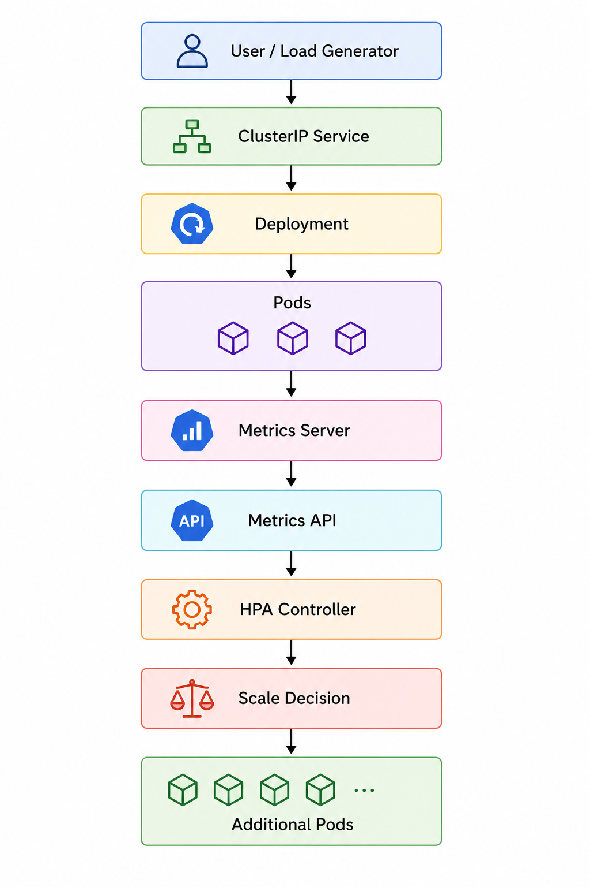
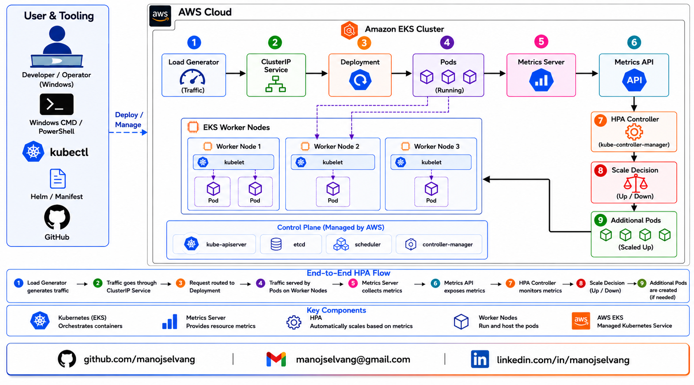

# Kubernetes Horizontal Pod Autoscaler (HPA) on AWS EKS using Metrics Server API

## Project Overview

This project demonstrates CPU-based autoscaling in Kubernetes using Horizontal Pod Autoscaler (HPA) on Amazon Elastic Kubernetes Service (EKS).

The implementation includes:
- Amazon EKS cluster provisioning
- Metrics Server installation
- Kubernetes Deployment and Service creation
- CPU resource requests and limits
- Horizontal Pod Autoscaler configuration
- Load generation for autoscaling validation
- Dynamic scale-out and scale-in verification
- Metrics monitoring and troubleshooting

The project validates the complete Kubernetes autoscaling lifecycle by generating traffic, monitoring CPU utilization, and observing automatic pod scaling behavior based on resource consumption.

---

# Architecture Diagram



---

# Detailed Architecture



---

# Objectives

The primary objectives of this project were:

- Deploy and manage a Kubernetes cluster using Amazon EKS
- Configure Kubernetes Metrics Server for resource monitoring
- Deploy containerized applications with resource constraints
- Implement Horizontal Pod Autoscaler (HPA)
- Simulate production-like traffic using load generators
- Observe Kubernetes autoscaling behavior under CPU pressure
- Validate automatic scale-out and scale-in operations
- Document troubleshooting and operational observations

---

# Technologies Used

| Technology | Purpose |
|---|---|
| AWS EKS | Managed Kubernetes Cluster |
| Kubernetes | Container orchestration |
| Metrics Server | Resource metrics collection |
| Horizontal Pod Autoscaler | Automatic pod scaling |
| kubectl | Kubernetes cluster management |
| eksctl | EKS cluster provisioning |
| Docker | Container runtime |
| BusyBox | Load generation |
| NGINX | Sample application |

---

# Project Structure

```text
k8s-hpa-eks-project/
│
├── README.md
├── screenshots/
│
├── manifests/
│   ├── deployment.yaml
│   ├── service.yaml
│   ├── hpa.yaml
│
├── docs/
│   ├── architecture.md
│   ├── troubleshooting.md
│   ├── scaling-analysis.md
│
└── commands/
    └── setup-commands.txt
```

---

# Prerequisites

Before starting this project, the following tools and configurations are required:

- AWS Account
- AWS CLI configured
- kubectl installed
- eksctl installed
- Docker installed
- IAM permissions for EKS management

---

# Environment Setup

## Verify AWS CLI

```bash
aws --version
```

## Verify kubectl

```bash
kubectl version --client
```

## Verify eksctl

```bash
eksctl version
```

## Configure AWS Credentials

```bash
aws configure
```

---

# EKS Cluster Creation

## Create EKS Cluster

```bash
eksctl create cluster \
--name hpa-demo-cluster \
--region ap-south-1 \
--nodegroup-name linux-nodes \
--node-type t3.medium \
--nodes 2
```

## Verify Cluster

```bash
kubectl get nodes
```

## Verify Cluster Information

```bash
kubectl cluster-info
```

---

# Metrics Server Installation

Horizontal Pod Autoscaler requires Metrics Server to collect CPU and memory metrics from Kubernetes nodes and pods.

## Install Metrics Server

```bash
kubectl apply -f https://github.com/kubernetes-sigs/metrics-server/releases/latest/download/components.yaml
```

## Verify Metrics Server

```bash
kubectl get deployment metrics-server -n kube-system
```

## Verify Metrics Collection

```bash
kubectl top nodes
```

```bash
kubectl top pods -A
```

---

# Application Deployment

A sample NGINX application was deployed with CPU and memory requests/limits to support HPA scaling decisions.

## Deployment Configuration

File:
```text
manifests/deployment.yaml
```

### Key Resource Configuration

```yaml
resources:
  requests:
    cpu: "100m"
    memory: "128Mi"

  limits:
    cpu: "500m"
    memory: "256Mi"
```

## Apply Deployment

```bash
kubectl apply -f manifests/deployment.yaml
```

## Verify Deployment

```bash
kubectl get deployments
```

```bash
kubectl get pods
```

---

# Service Configuration

A ClusterIP service was created to expose the application internally within the Kubernetes cluster.

## Apply Service

```bash
kubectl apply -f manifests/service.yaml
```

## Verify Service

```bash
kubectl get svc
```

---

# Horizontal Pod Autoscaler (HPA)

The Horizontal Pod Autoscaler was configured using CPU utilization metrics.

## HPA Configuration

File:
```text
manifests/hpa.yaml
```

### HPA Parameters

| Parameter | Value |
|---|---|
| Minimum Replicas | 1 |
| Maximum Replicas | 10 |
| Target CPU Utilization | 50% |

## Apply HPA

```bash
kubectl apply -f manifests/hpa.yaml
```

## Verify HPA

```bash
kubectl get hpa
```

```bash
kubectl describe hpa hpa-demo
```

---

# Load Testing

BusyBox was used to generate continuous traffic inside the Kubernetes cluster.

## Create Load Generator

```bash
kubectl run load-generator \
--image=busybox \
--restart=Never \
-- /bin/sh -c "while true; do wget -q -O- http://hpa-demo-service; done"
```

## Monitor HPA

```bash
kubectl get hpa -w
```

## Monitor Pods

```bash
kubectl get pods -w
```

---

# Autoscaling Verification

The following autoscaling behavior was observed during testing:

| Observation | Result |
|---|---|
| Initial Pod Count | 1 |
| Peak CPU Utilization Observed | 148% |
| HPA Threshold | 50% |
| Scale-Out Triggered | Yes |
| Replica Scaling Progression | 1 → 2 → 3 → 4 |
| Maximum Replica Count Observed | 4 |
| CPU Utilization Reduced After Scaling | Yes |
| Automatic Scale-In Verified | Yes |
| Final Stable Replica Count | 1 |

---

# Scaling Analysis

The Horizontal Pod Autoscaler continuously monitored CPU utilization metrics from the Metrics API.

During load testing, CPU utilization increased progressively:

```text
21% → 73% → 148%
```

Since the configured HPA target was:

```text
50%
```

the HPA controller triggered automatic scale-out operations.

The deployment replica count increased dynamically:

```text
1 → 2 → 3 → 4
```

After additional pods were created:
- Traffic distribution improved
- CPU utilization reduced gradually
- Cluster workload stabilized automatically

Observed CPU reduction after scaling:

```text
58% → 44% → 31% → 15% → 0%
```

Once load generation stopped:
- CPU utilization dropped completely
- HPA stabilization logic delayed immediate scale-in
- Kubernetes gradually reduced replicas back to a single pod

Final scale-in lifecycle:

```text
4 → 3 → 2 → 1
```

This validated:
- Dynamic CPU-based autoscaling
- Automatic workload distribution
- Stabilization window behavior
- Scale-out and scale-in lifecycle
- Kubernetes HPA decision-making process

---

# HPA Scaling Formula

Horizontal Pod Autoscaler calculates desired replicas using:

:contentReference[oaicite:0]{index=0}

Example observed during testing:

:contentReference[oaicite:1]{index=1}

Kubernetes scaled the deployment progressively as CPU utilization remained above the configured threshold.

---

# Troubleshooting

## Metrics API Not Available

### Issue

```bash
error: Metrics API not available
```

### Fix

Added the following argument to Metrics Server deployment:

```yaml
- --kubelet-insecure-tls
```

---

## HPA TARGETS Showing `<unknown>`

### Cause

Metrics pipeline synchronization delay.

### Resolution

Waited for Metrics Server synchronization and verified metrics using:

```bash
kubectl top nodes
```

```bash
kubectl top pods
```

---

## Load Generator Command Failed in Windows CMD

### Cause

Windows CMD parsing issues with multiline shell commands.

### Resolution

Used single-line command format:

```cmd
kubectl run load-generator --image=busybox --restart=Never --command -- sh -c "while true; do wget -q -O- http://hpa-demo-service; done"
```

---

# Key Learnings

- Metrics Server is mandatory for HPA functionality
- HPA scales based on CPU requests, not limits
- Scaling is not instantaneous due to stabilization windows
- CPU utilization decreases after traffic distribution across replicas
- Kubernetes prevents rapid scaling fluctuations (flapping)
- Resource requests directly influence autoscaling behavior
- Metrics pipeline delays can temporarily affect HPA visibility
- Kubernetes autoscaling depends on Metrics API availability

---

# Screenshots

## Environment Setup
- AWS CLI verification
- kubectl setup
- eksctl setup
- Cluster creation progress

## Cluster Validation
- Worker nodes ready
- kube-system pods
- Cluster information

## Metrics Server
- Metrics Server deployment
- kubectl top nodes
- kubectl top pods

## Deployment and Service
- Application deployment
- Running pods
- ClusterIP service

## HPA Validation
- HPA creation
- HPA monitoring
- Scaling trigger
- Replica increase
- Scale-in verification

All screenshots are available in the `screenshots/` directory.

---

# Cleanup

## Delete Load Generator

```bash
kubectl delete pod load-generator
```

## Delete Kubernetes Resources

```bash
kubectl delete -f manifests/
```

## Delete EKS Cluster

```bash
eksctl delete cluster --name hpa-demo-cluster --region ap-south-1
```


# Conclusion

This project successfully demonstrated Kubernetes Horizontal Pod Autoscaler (HPA) implementation on AWS EKS using CPU utilization metrics.

The project validated:
- Kubernetes metrics collection
- Dynamic workload scaling
- Automatic replica management
- Resource-based scaling decisions
- Scale-out and scale-in lifecycle
- Operational troubleshooting and monitoring

The implementation provides practical understanding of Kubernetes autoscaling behavior and production-oriented operational workflows.

Author:
- Manoj Selvan G
- manojselvang@gmail.com
- [github.com/manojselvang](https://github.com/manojselvang)
- https://www.linkedin.com/in/manoj-selvan-g/
